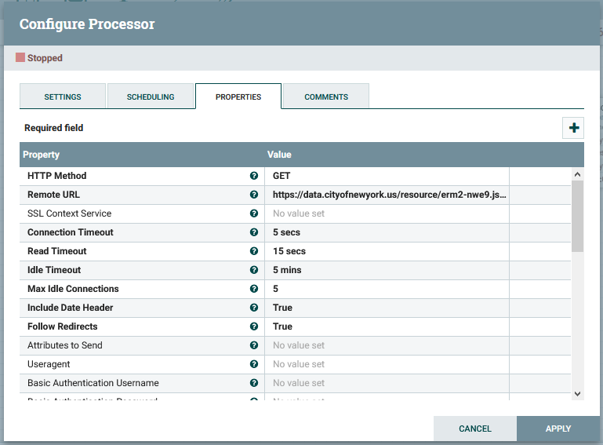
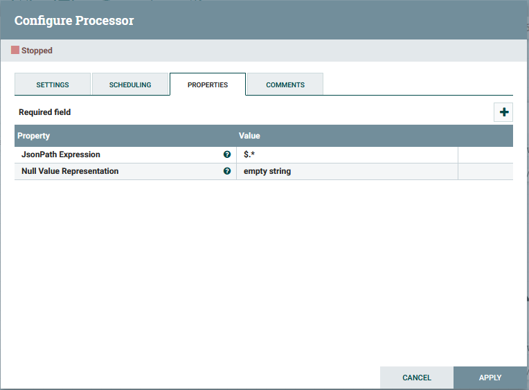
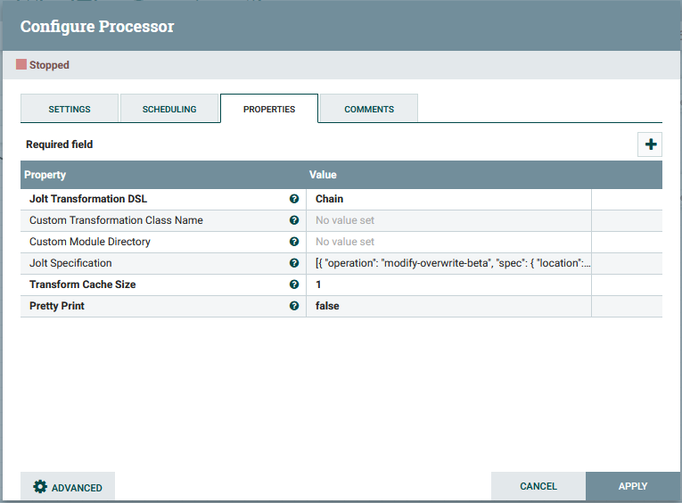
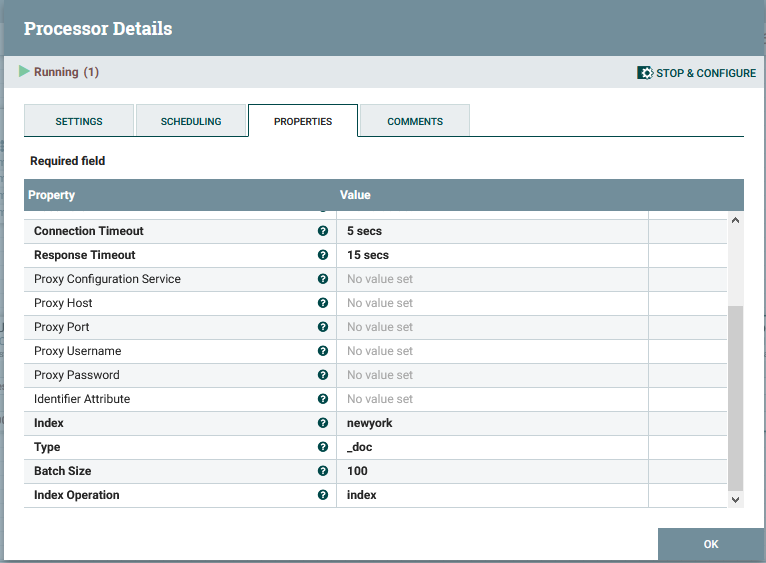
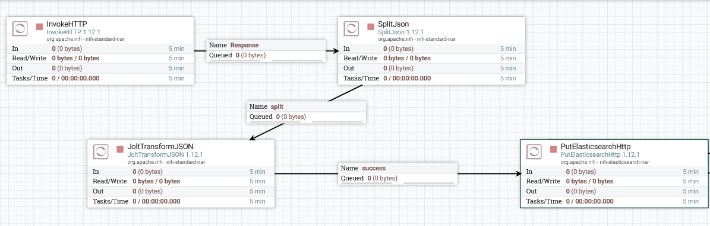
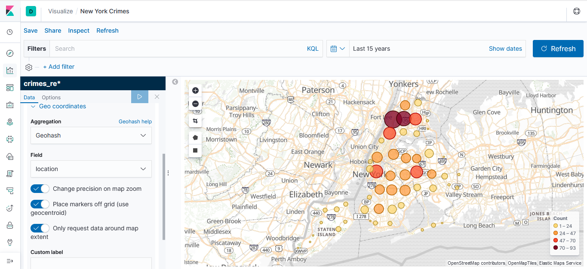
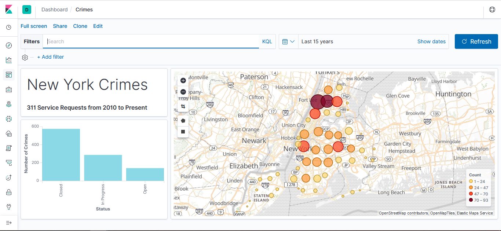

# Entregable 2

Usando nifi+ELK debéis presentar una solución que muestre sobre un mapa la disposición de delitos presentes en esta api:

 

https://data.cityofnewyork.us/Social-Services/311-Service-Requests-from-2010-to-Present/erm2-nwe9

### Requisitos

* ElasticSearch (9200, 9300)
* Kibana (5601)
* Nifi (8080)

### Pasos

**Levantar docker**

Dentro de la carpeta docker: 

`docker-compose up -d`

**Configurar Nifi**

Componetes usados:

* InvokeHttp

* SplitJSON

* JoltTransformJSON

<code>[{
	"operation": "modify-overwrite-beta",
	"spec": {
		"location": {
			"latitude": "=toDouble",
			"longitude": "=toDouble"
		}
	}
}, {
	"operation": "shift",
	"spec": {
		"*": "&",
		"location": {
			"latitude": "location.lat",
			"longitude": "location.lon"
		}
	}
}]
</code>

* PutElasticsearchHttp

*url: http://elasticsearch:9200*

**Resumen Nifi**

**Comprobar los indices**

Dentro de [Kibana](http://localhost:5601) en Management -> Index Management

Comprobamos que se ha creado el indice y están los documentos

**Reindexar**

Para conseguir que "location" sea de tipo "geo_point" hay que crear un nuevo indice con este tipo y acumular en este los documentos.

Desde Kibana en DevTools:

<code>
PUT /crimes_re
{
  "mappings" : {
    "properties": {
      "location": {
        "type": "geo_point"
      }
    }
  }
}
POST _reindex
{
  "source": {
    "index": "crimes"
  },
  "dest": {
    "index": "crimes_re"
  }
}
</code>

**Visualizar los datos**

Desde Kibana en Visualize, creamos uno nuevo (Create new visualization) y seleccionamos Coordinate Map

**Resultado final**

Creamos un dashboard y añadimos las visualizaciones

### Extra

