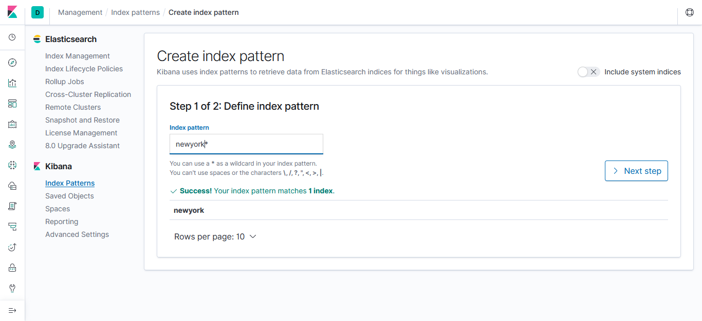
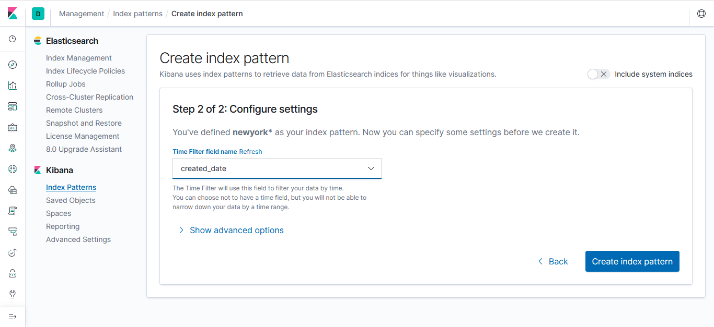
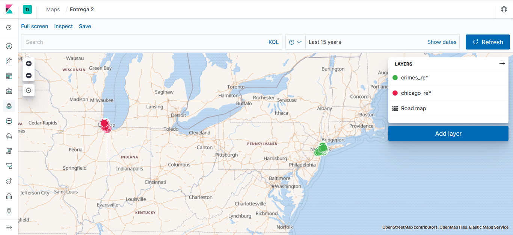

# Entregable 2

Usando nifi+ELK debéis presentar una solución que muestre sobre un mapa la disposición de delitos presentes en esta api:

 

https://data.cityofnewyork.us/Social-Services/311-Service-Requests-from-2010-to-Present/erm2-nwe9


### Requisitos

* ElasticSearch (9200, 9300)
* Kibana (5601)
* Nifi (8080)


### Pasos

**Levantar docker**

Dentro de la carpeta docker: 

`docker-compose up -d`

**Configurar Nifi**

Componetes usados:

* InvokeHttp


* SplitJSON


* JoltTransformJSON


```
[{
	"operation": "modify-overwrite-beta",
	"spec": {
		"location": {
			"latitude": "=toDouble",
			"longitude": "=toDouble"
		}
	}
}, {
	"operation": "shift",
	"spec": {
		"*": "&",
		"location": {
			"latitude": "location.lat",
			"longitude": "location.lon"
		}
	}
}]
```

* PutElasticsearchHttp


*Elasticsearch URL: http://elasticsearch:9200*

*Index: newyork (nombre del indice)*

*Type: _doc*

*Index Operation: index*

**Resumen Nifi**


**Mapping**

Para conseguir que "location" sea de tipo "geo_point" hay que crear un nuevo índice con este tipo y acumular en este los documentos.

Desde Kibana -> DevTools:

```
PUT /chicago
{
  "mappings" : {
    "properties": {
      "location": {
        "type": "geo_point"
      }
    }
  }
}
PUT /newyork
{
  "mappings" : {
    "properties": {
      "location": {
        "type": "geo_point"
      }
    }
  }
}
```

**Cargar los datos**

Una vez realizado el paso anterior (crear los índices con el mapping location de tipo geo_point), iniciamos el flow de Nifi.

Esperamos unos minutos (tarda unos 5 minutos en acumular los documentos)

**Crear los Index Patterns**

Una vez estén todos los documentos (Kibana -> Management -> Index Management), tenemos que crear los Index Patterns para poder hacer las visualizaciones de los datos en Kibana.

Para ello vamos a Kibana -> Management -> Index Patterns y pulsamos sobre "Create index pattern".

Introducimos el nombre del índice (o parte de él) y pulsamos en "Next step"



Escogemos que atributo de los datos vamos a utilizar como timestamp(time filter). En nuestro caso creo que el mas representativo es el "created_date".



Y por último pulsamos en "Create index pattern"

**Visualizar los datos**

Desde Kibana -> Visualize, creamos uno nuevo (Create new visualization) y seleccionamos Coordinate Map


**Resultado final**

Desde Kibana -> Dashborard, creamos un dashboard (Create new dashboard) y añadimos las visualizaciones


### Extra

Repetir el proceso anterior.

**Visualizar los datos conjuntos**

En el apartado Maps de [Kibana](http://localhost:5601) creamos un nuevo mapa y añadimos una capa por cada indice(ciudad).

Pulsamos sobre "Add Layer" y como fuente seleccionamos "Documents", seleccionamos el índice que queramos añadir y por ultimo pulsamos en Add layer.

Repetimos este paso por cada índice(ciudad) que queramos añadir.

Por últimos, pulsamos en "Save" antes de salir



### Conclusiones

El índice que se crea manual desde el Dev Tools solo hay que crearlo la primera vez, ya que realmente lo que creamos es el mapping, es decir, el esquema de los datos. Luego el proceso es completamente automático.


### Anexos

`docker/docker-compose.yml` -> Fichero docker compose para levantar los contenedores necesarios

`Nifi+ELK.json` -> Flow de Nifi con todos los procesadores ya configurados (listo para iniciar)

`Nifi+ELK.xml` -> Plantilla para importar en Nifi, con el flow descrito en este documento.